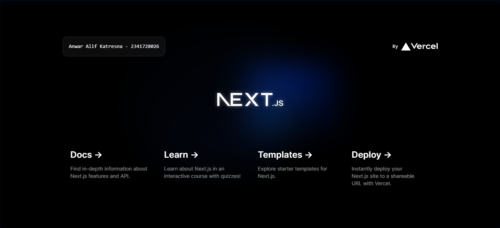
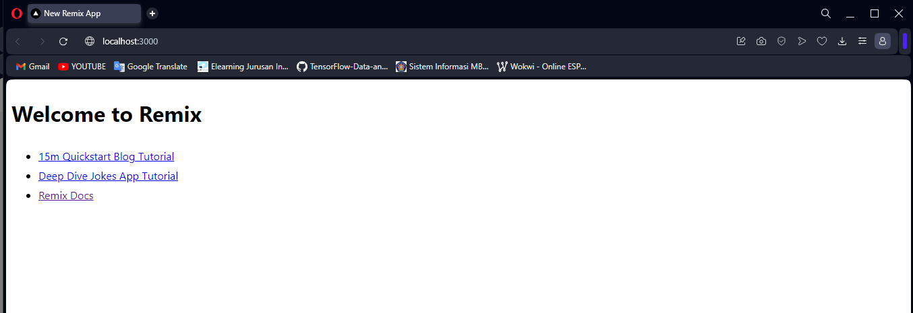
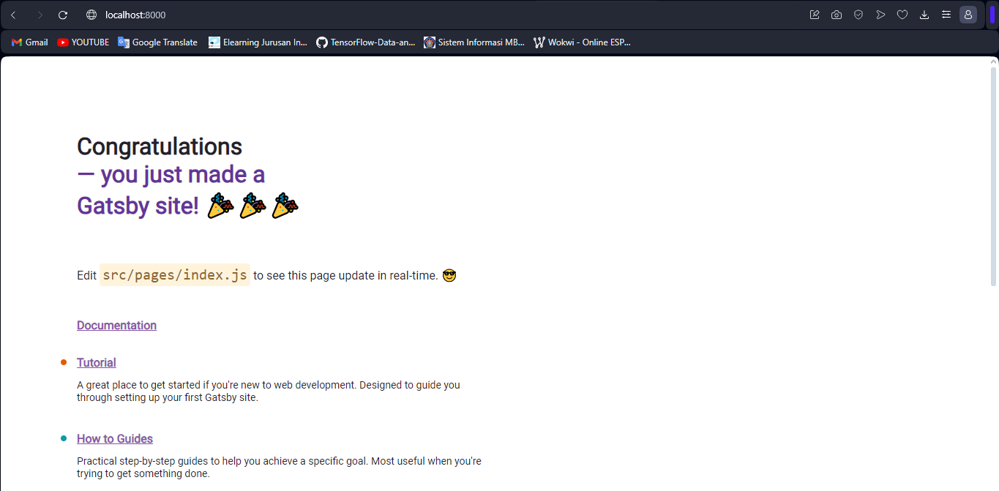

## Laporan Pratikum: Membuat Project Pertama ReactJS
|  | Pemrograman Berbasis Framework 2024 |
|--|--|
| NIM |  2341728026|
| Nama |  Anwar Alif Katresna |
| Kelas | TI - 3A |
>**Soal 1** 
apa yang dimaksud dengan
TypeScript
ESLint,
Tailwind CSS,
App Router,
Import alias?
- TypeScript  
TypeScript adalah superset JavaScript yang diketik secara statis yang menambahkan definisi tipe, memungkinkan tooling, pelengkapan otomatis, dan pengecekan kesalahan yang lebih baik. Untuk menggunakan TypeScript dalam proyek React, Anda perlu menambahkannya sebagai dependensi dan mengonfigurasinya menggunakan file **'tsconfig.json'**.
- ESLint  
ESlint adalah adalah alat linting yang dapat dicolokkan untuk JavaScript yang membantu menjaga kualitas dan konsistensi kode. Alat ini dapat dikonfigurasi untuk menerapkan aturan dan gaya tertentu. Untuk menggunakan ESLint dengan TypeScript dan React, Anda perlu menginstal plugin yang diperlukan dan mengonfigurasinya dalam file **'.eslintrc'**.
- Tailwind CSS  
Tailwind CSS adalah kerangka kerja CSS yang mengutamakan utilitas yang menyediakan kelas-kelas utilitas tingkat rendah untuk membuat desain khusus. Untuk menggunakan Tailwind CSS dengan proyek React, Anda harus menginstalnya sebagai dependensi dan mengonfigurasinya menggunakan file postcss **'.config.js'**.
- App Router  
App Router adalah sebuah konsep di Next.js yang memungkinkan Anda untuk menentukan sistem perutean untuk aplikasi Anda menggunakan file dan folder. Dengan menempatkan folder halaman **('pages')** di root proyek Anda, Next.js akan secara otomatis menghasilkan sistem perutean berdasarkan nama file dan struktur folder.    
- Import Alias  
 Import alias adalah cara untuk menyederhanakan dan mempersingkat pernyataan impor dengan mendefinisikan jalur khusus untuk modul. Dalam proyek TypeScript dan React, Anda dapat mendefinisikan alias impor dalam file **'tsconfig.json'**.

 >**Soal 2** Pada struktur project tersebut, jelaskan kegunaan folder dan file masing-masing tersebut!

- node_modules  
Folder ini berisi semua dependensi dan pustaka yang diperlukan untuk proyek. Folder ini dibuat secara otomatis ketika menginstal paket yang diperlukan.
- public  
Folder ini berisi aset statis yang disajikan apa adanya, seperti gambar, font, dan file lainnya. Aset-aset ini dapat diakses menggunakan URL yang dimulai dengan URL dasar aplikasi.
- src  
Folder ini berisi semua kode sumber untuk aplikasi React. Folder ini berisi berkas-berkas:  
  - favicon
  - global.css: berisi styles CSS global dan modul CSS tingkat komponen. Styles global diimpor di _app.js, sedangkan gaya tingkat komponen diimpor di file komponen yang sesuai.
  - layout.tsx: File ini mendefinisikan tata letak untuk aplikasi. Biasanya berisi header, footer, dan elemen umum lainnya yang muncul di beberapa halaman.
  - page.tsx: File ini mendefinisikan satu halaman aplikasi. Setiap halaman memiliki rutenya sendiri dan dapat memiliki tata letak, komponen, dan gayanya sendiri.  
- .eslintrc.json  
File ini adalah file konfigurasi untuk ESLint, linter kode untuk JavaScript dan TypeScript. File ini mendefinisikan aturan dan standar untuk basis kode, seperti lekukan, konvensi penamaan, dan panjang baris maksimum.
- .gitignore  
File ini menentukan file dan direktori mana yang harus diabaikan oleh Git, sistem kontrol versi. Ini membantu mengecualikan berkas yang tidak perlu, seperti artefak build, dependensi, dan berkas editor, dari repositori.
- next-env.d.ts  
File ini berisi deklarasi TypeScript untuk lingkungan Next.js. Ini memungkinkan TypeScript untuk mengenali variabel dan fungsi global yang disediakan oleh Next.js. 
- next.config.mjs  
File ini adalah file konfigurasi untuk Next.js. File ini dapat digunakan untuk menyesuaikan perilaku kerangka kerja, seperti menambahkan konfigurasi webpack khusus, menyiapkan rendering sisi server, dan mengaktifkan pemisahan kode.
- package.json  
File ini berisi metadata tentang proyek, seperti nama, versi, dependensi, dan skrip. File ini juga mendefinisikan titik masuk untuk aplikasi dan skrip build.
- package-lock.json  
File ini secara otomatis dihasilkan oleh npm, manajer paket. File ini berisi cuplikan versi dari dependensi dan versinya, yang membantu memastikan build yang konsisten di berbagai mesin dan lingkungan.
- postcss.config.js  
File ini berisi konfigurasi untuk PostCSS, alat untuk mengubah kode CSS. Ini memungkinkan Anda untuk menggunakan plugin, seperti Autoprefixer, untuk menambahkan awalan vendor dan mengoptimalkan kode CSS.
- README.md  
File ini berisi dokumentasi dan instruksi untuk proyek, seperti proses instalasi, contoh penggunaan, dan panduan berkontribusi.
- tailwind.config.ts  
Berkas ini berisi konfigurasi untuk Tailwind CSS, sebuah kerangka kerja CSS yang populer. Ini memungkinkan Anda untuk menyesuaikan gaya, seperti menambahkan warna, font, dan breakpoint khusus.
- tsconfig.json  
File ini berisi konfigurasi untuk TypeScript, superset JavaScript yang diketik secara statis. File ini mendefinisikan opsi kompiler, seperti versi target, sistem modul, dan peta sumber.

> **Soal 3** Gantilah teks pada bagian atas dengan Nama - NIM.

> **Perbedaan Next.js, Remix, & Gatsby**  

|  |  |
|--|--|
| **Next.js** | full-stack framework React, membuat aplikasi React dalam berbagai ukuran—mulai dari halaman blog statis hingga aplikasi dinamis yang kompleks. Next.js dikelola oleh Vercel, dapat dipasang aplikasi Next.js ke semua ekosistem berbasis Node.js atau serverless hosting atau pada server Anda sendiri. Aplikasi statis Next.js dapat dipasang pada layanan hosting statis apa pun.|
| **Remix** |  full-stack framework React yang menggunakan teknologi nested routing, dapat memecah aplikasike dalam bagian - bagian bersarang yang dapat memuat data secara paralel dan melakukan refresh sebagai bentuk respon dari aksi yang dilakukan oleh pengguna, Remix dikelola oleh Shopify. Saat Anda membuat proyek Remix, Anda perlu untuk memilih target pemasangan Anda. Anda dapat memasang aplikasi Remix ke semua hosting Node.js atau serverless dengan menggunanakan atau menuliskan sebuah adaptor. |
|**Gatsby** | framework React untuk situs web berbasis sistem manajemen konten cepat. Ekosistem plugin yang dimiliki serta lapisan data GraphQL dari Gatsby dapat memudahkan Anda dalam melakukan integrasi konten, API, dan layanan ke dalam satu situs web. Gatsby dikelola oleh Netlify. Anda dapat memasang situs statis Gatsby ke hosting statis apa pun. Jika Anda memilih untuk menggunakan fitur server-only, Anda perlu memastikan jika penyedia layanan hosting mendukung hal tersebut untuk Gatsby. |    

>Screenshot Tampilan  
**Next.js**

**Remix**

**Gatsby**

